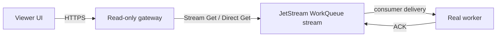
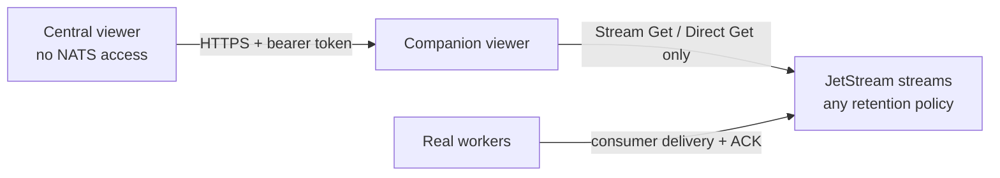

# NATS JetStream Viewer

A self-hosted, read-only operations console for inspecting messages stored in NATS JetStream—including streams using `WorkQueuePolicy`—without creating consumers, delivering messages, or sending acknowledgements.

The viewer connects to several independent NATS systems at the same time, keeps credentials in an encrypted server-side configuration file, and supports sandboxed JavaScript unmarshalling per stream. A central viewer that is not allowed to connect to NATS can instead use a bearer-protected read-only HTTP gateway exposed by a companion viewer inside the trusted NATS network.

> **Safety invariant:** payloads are read only with JetStream Stream Get or Direct Get. The application contains no consumer creation, consumer fetch, ACK, stream purge, stream delete, or message delete operation.

## Capabilities

- Multiple simultaneous NATS server/cluster profiles.
- Direct NATS and read-only HTTP gateway profile modes.
- Several seed URLs per profile for normal NATS failover.
- Stored JetStream message browser with sequence pagination and subject filtering.
- Direct Get batch reads when `allow_direct` is enabled.
- Leader-consistent Stream Get fallback when Direct Get is unavailable or denied.
- JSON, UTF-8, Base64, headers, timestamps, sizes, and stream sequence views.
- Consumer lag and delivery metadata through Consumer Info only.
- Per-profile, per-stream JavaScript decoders in an isolated QuickJS runtime.
- Username/password, token, `.creds`, TLS CA, and mutual-TLS-ready backend model.
- Encrypted configuration at rest with AES-256-GCM.
- Single-admin login using an HTTP-only, signed, expiring cookie.
- Responsive React dashboard and one production container.
- Real NATS integration tests proving WorkQueue messages remain available to workers.

## How reads stay non-consuming



WorkQueue retention removes a message after a real consumer acknowledges it (or when a configured stream limit/TTL removes it). Stream Get and Direct Get query stream storage directly: they do not create a consumer, establish an ACK-pending state, advance a delivery cursor, or acknowledge a message.

A consumer is not a safe substitute for these APIs. `AckNone` consumers are rejected on WorkQueue streams, while an explicit-ack consumer that does not ACK still receives and reserves deliveries, advances consumer state, and competes with workers. The viewer therefore has no consumer-delivery mode.

For a detailed explanation, failure examples, CLI experiment, and architecture comparison, open [`docs/why-consumer-viewing-is-unsafe.html`](docs/why-consumer-viewing-is-unsafe.html).

The integration suite starts two independent NATS systems: a real WorkQueue stream with a durable worker and a separate Limits-policy stream. It reads both through the viewer with stream-specific decoders, then asserts that the WorkQueue stream and worker remain unchanged:

- the stream message count is unchanged;
- the worker's pending count is unchanged;
- ACK-pending remains zero;
- the consumer delivery sequence does not move; and
- the worker still receives stream sequence 1 afterward.

## Quick start with Docker Compose

Requirements: Docker Engine with Compose v2.

```bash
cp .env.example .env
```

Generate the required secrets and paste them into `.env`:

```bash
openssl rand -base64 32   # NJV_MASTER_KEY
openssl rand -base64 48   # NJV_SESSION_SECRET
openssl rand -base64 24   # a possible NJV_ADMIN_PASSWORD
```

Then launch:

```bash
docker compose up -d --build
```

Open `http://localhost:3000`. Put the service behind an HTTPS reverse proxy before exposing it outside a trusted network.

The encrypted connection configuration is persisted in the `viewer-data` volume. Back up `NJV_MASTER_KEY` securely: losing it makes the stored profiles unrecoverable. Changing it without migrating the data has the same effect.

## Run from source

Node.js 22 or newer is required; Node.js 24 is used in CI and the container.

```bash
npm ci
cp .env.example .env
set -a && . ./.env && set +a
npm run dev:full
```

The UI runs on port 5173 in development and proxies API calls to port 3000. A production build is served as one process:

```bash
npm run build
npm start
```

## NATS permissions

Use a dedicated NATS identity for the viewer. An example is provided at [`examples/nats-viewer-user.conf`](examples/nats-viewer-user.conf).

The backend needs permission to publish requests to:

```text
$JS.API.STREAM.LIST
$JS.API.STREAM.INFO.>
$JS.API.STREAM.MSG.GET.>
$JS.API.DIRECT.GET.>
$JS.API.CONSUMER.LIST.>
$JS.API.CONSUMER.INFO.>
```

and subscribe to its request inbox:

```text
_INBOX.>
```

Do not grant ACK, consumer-create, purge, delete, or update subjects. This turns the safety invariant into a server-enforced authorization boundary as well as an application rule.

## Read-only HTTP gateway mode

Use gateway mode when the central viewer cannot connect to NATS. Some component must still have authorized access to JetStream storage; deploy a companion viewer inside the trusted NATS network for that role.



On the companion viewer:

1. Configure a normal direct-NATS profile with the restricted permissions listed above.
2. Set a random gateway token in its environment:

   ```bash
   NJV_GATEWAY_TOKEN=<at-least-32-byte-random-secret>
   ```

3. Expose the companion viewer to the central viewer through HTTPS. The gateway is available under `/gateway/v1/*` and accepts only the bearer token; it does not use the browser admin session.
4. Note the direct profile ID shown on the Connections page.

On the central viewer, add a connection and choose **Read-only HTTP gateway**. Enter the companion viewer base URL, its direct profile ID, and the same gateway token. Gateway credentials are encrypted at rest and never returned to the browser after saving.

The gateway forwards stream lists, stream/consumer metadata, and stored-message reads. It forces decoding off at the companion and applies any configured decoder in the central viewer. It exposes no publish, consumer fetch/create, ACK, purge, update, or delete endpoint.

If neither the viewer nor a trusted companion is permitted to connect to NATS or call the read-only JetStream APIs, live inspection is impossible. The remaining safe architecture is an administrator-configured server-side republish into a separate Limits-policy audit stream, followed by storage-only access to that audit stream.

### Enable Direct Get

For efficient page reads, enable `allow_direct` on a stream with an administrator identity:

```bash
nats stream edit WORK_STREAM --allow-direct
```

If Direct Get is disabled, unsupported, or not authorized, the viewer falls back to regular Stream Get. The fallback is leader-consistent but scans at most `max(page size × 20, 1000)` sequences per request so a sparse stream cannot cause unbounded API traffic.

## Multiple NATS systems

Each profile is one independent NATS system and owns one live backend connection. Configure separate profiles to inspect production, staging, different accounts, or unrelated clusters concurrently.

Several URLs inside one profile are NATS seed URLs for discovery and failover within that system:

```text
nats://nats-1.internal:4222
nats://nats-2.internal:4222
nats://nats-3.internal:4222
```

Credentials in URLs are rejected because profiles are returned to the frontend with their server addresses. Use the dedicated authentication fields; their secrets are never returned by the API.

## Custom unmarshalling

Create one decoder for a specific profile and stream. A decoder must define:

```javascript
function decode(input) {
  return JSON.parse(input.payload.utf8);
}
```

Input shape:

```typescript
{
  subject: string;
  sequence: number;
  timestamp: string;
  headers: Record<string, string[]>;
  payload: {
    utf8: string;
    base64: string;
  };
}
```

The return value must be JSON-serializable. The original payload is always retained in the response, so a decoder error does not hide the stored message.

### Sandbox boundaries

Decoder code runs in QuickJS, not the Node.js host context. Each invocation has:

- a 50 ms execution deadline;
- an 8 MiB memory limit;
- a 256 KiB stack limit;
- a 1 MiB serialized-output limit;
- no `process`, `require`, filesystem, network, environment, timers, or NATS connection.

Decoders are still administrator-provided code. Review scripts before saving them, keep the viewer private, and restrict who can sign in.

## Security model

- Connection secrets and decoder scripts are encrypted together with AES-256-GCM.
- The master encryption key exists only in the deployment environment.
- Profiles returned to the browser contain auth type and configuration state, never passwords, tokens, credential contents, or private keys.
- Admin sessions are HMAC-signed, HTTP-only, SameSite=Strict, and expire after 12 hours.
- Mutating requests are checked for same-origin.
- Helmet supplies a restrictive Content Security Policy and standard response hardening.
- The container runs as an unprivileged user with all Linux capabilities dropped, a read-only root filesystem, and `no-new-privileges` in Compose.
- The application never logs stored message payloads or connection secrets.

For internet-facing use, add TLS, rate limiting, an identity-aware proxy, and centralized access logs at the reverse proxy. The built-in login is intentionally a single-administrator deployment model, not organization-wide RBAC.

## WorkQueue caveats

- The viewer shows only messages that still exist in stream storage.
- A real worker can ACK a message while it is open in the UI, so a later refresh may show it as missing.
- Missing does not necessarily mean processed: `MaxAge`, `MaxMsgs`, `MaxBytes`, per-message TTL, purge, or an administrative delete can also remove it.
- Direct Get can be served by a replica and may be momentarily stale. Fetching one message by sequence uses Stream Get from the stream leader.
- Consumer metadata is informational and can change independently while displayed.

## Verification

```bash
npm run typecheck
npm test
npm run test:integration
npm run build
```

`npm run test:all` runs all four gates. The integration test uses a pinned NATS Server binary as a development dependency; production images do not contain it.

## Project structure

```text
src/                 Express gateway, NATS access, encryption, auth, sandbox
web/                 React dashboard
examples/            Restricted NATS user configuration
.github/workflows/   CI and GHCR publishing
Dockerfile           Hardened multi-stage production image
compose.yaml         Single-command self-hosted deployment
```

## Reference and license

The interface direction was informed by [gastbob40/nats-ui](https://github.com/gastbob40/nats-ui), which is BSD-3-Clause licensed. This repository is a clean implementation with a different architecture focused on historical JetStream storage inspection, multiple concurrent systems, server-side credentials, and decoder isolation; no reference source code is included.

Licensed under Apache-2.0. See [`LICENSE`](LICENSE).
